# EmoVerse AI - Architecture Diagram

## AWS AI Agent Global Hackathon - Social Emotional Learning Platform

```mermaid
graph TB
    %% User Interface Layer
    subgraph "Frontend Layer"
        U[👨‍🎓 Student/👩‍🏫 Teacher<br/>User Interface]
        ST[🌈 Streamlit App<br/>app_demo.py]
        U --> ST
    end

    %% AWS Cloud Services
    subgraph "AWS Cloud Infrastructure"
        
        %% API Gateway and Lambda
        subgraph "API & Orchestration"
            API[🚪 API Gateway<br/>REST Endpoints]
            LAMBDA[⚡ AWS Lambda<br/>Orchestration Functions]
            API --> LAMBDA
        end

        %% AI/ML Services
        subgraph "AI/ML Services"
            BEDROCK[🧠 Amazon Bedrock<br/>Claude Sonnet 4.5<br/>Story & Quiz Generation]
            COMPREHEND[💭 Amazon Comprehend<br/>Sentiment Analysis]
            TEXTRACT[📄 Amazon Textract<br/>Document Text Extraction]
            TRANSCRIBE[🎤 Amazon Transcribe<br/>Voice-to-Text]
        end

        %% Storage Services
        subgraph "Storage & Data"
            S3[📦 Amazon S3<br/>Document Storage<br/>sel-platform-uploads]
            DYNAMO[🗄️ DynamoDB<br/>Analytics & Memory<br/>sel-ltm-memory-analytics]
        end

        %% AI Agent Services
        subgraph "AI Agent Runtime"
            AGENT_CORE[🤖 AgentCore Runtime<br/>Multi-Tier Story Generation]
            AGENT_MEM[🧠 AgentCore Memory<br/>Session Management]
            AGENT_OBS[👁️ AgentCore Observability<br/>Performance Tracking]
            PLAYWRIGHT[🌐 Playwright Agent<br/>External Story Search]
        end

        %% Security & Identity
        subgraph "Security Layer"
            COGNITO[🔐 Amazon Cognito<br/>User Authentication]
            IAM[🛡️ AWS IAM<br/>Access Control]
        end
    end

    %% External Services
    subgraph "External Resources"
        EXT1[📚 Storyline Online]
        EXT2[🎨 Storyberries]
        EXT3[🧠 KidsKonnect SEL]
    end

    %% Flow Connections
    ST --> API
    
    %% Document Processing Flow
    LAMBDA --> S3
    LAMBDA --> TEXTRACT
    LAMBDA --> COMPREHEND
    S3 --> TEXTRACT
    
    %% AI Content Generation Flow
    LAMBDA --> BEDROCK
    LAMBDA --> AGENT_CORE
    AGENT_CORE --> AGENT_MEM
    AGENT_CORE --> BEDROCK
    
    %% Voice Processing
    LAMBDA --> TRANSCRIBE
    S3 --> TRANSCRIBE
    
    %% External Story Search (Tier 3)
    AGENT_CORE --> PLAYWRIGHT
    PLAYWRIGHT --> EXT1
    PLAYWRIGHT --> EXT2
    PLAYWRIGHT --> EXT3
    
    %% Data Storage
    LAMBDA --> DYNAMO
    AGENT_MEM --> DYNAMO
    
    %% Security
    ST --> COGNITO
    LAMBDA --> IAM
    
    %% Monitoring
    AGENT_CORE --> AGENT_OBS

    %% Styling
    classDef frontend fill:#e1f5fe,stroke:#01579b,stroke-width:2px
    classDef aws fill:#ff9800,stroke:#e65100,stroke-width:2px
    classDef ai fill:#4caf50,stroke:#1b5e20,stroke-width:2px
    classDef storage fill:#2196f3,stroke:#0d47a1,stroke-width:2px
    classDef agent fill:#9c27b0,stroke:#4a148c,stroke-width:2px
    classDef security fill:#f44336,stroke:#b71c1c,stroke-width:2px
    classDef external fill:#607d8b,stroke:#263238,stroke-width:2px

    class U,ST frontend
    class API,LAMBDA aws
    class BEDROCK,COMPREHEND,TEXTRACT,TRANSCRIBE ai
    class S3,DYNAMO storage
    class AGENT_CORE,AGENT_MEM,AGENT_OBS,PLAYWRIGHT agent
    class COGNITO,IAM security
    class EXT1,EXT2,EXT3 external
```

## Architecture Components

### 1. Frontend Layer
- **Streamlit Application**: Interactive web interface for students and teachers
- **Multi-user Support**: Session isolation and user type management
- **Real-time Processing**: Immediate feedback and content generation

### 2. API & Orchestration Layer
- **API Gateway**: RESTful endpoints for frontend communication
- **AWS Lambda**: Serverless orchestration of AI services
- **Async Processing**: Background content generation with status polling

### 3. AI/ML Services Integration
- **Amazon Bedrock (Claude Sonnet 4.5)**: 
  - Story generation based on uploaded content
  - Quiz creation with multiple question types
  - Grade-appropriate content adaptation
- **Amazon Comprehend**: Sentiment analysis of educational content
- **Amazon Textract**: OCR for PDF and image document processing
- **Amazon Transcribe**: Voice question processing

### 4. AI Agent Runtime (Multi-Tier System)
- **Tier 1**: Direct Bedrock generation (immediate response)
- **Tier 2**: Regeneration with different themes/approaches
- **Tier 3**: Playwright agent for external story discovery
- **AgentCore Memory**: Session and preference management
- **AgentCore Observability**: Performance monitoring and analytics

### 5. Storage & Data Management
- **Amazon S3**: Document uploads and temporary file storage
- **DynamoDB**: Student analytics, quiz results, and long-term memory

### 6. Security & Identity
- **Amazon Cognito**: User authentication and session management
- **AWS IAM**: Fine-grained access control for services

### 7. External Integration
- **Playwright Web Agent**: Automated discovery of educational content from:
  - Storyline Online (celebrity read-alouds)
  - Storyberries (illustrated stories)
  - KidsKonnect (SEL resources)

## Data Flow

1. **Document Upload**: Student uploads PDF/image → S3 → Textract → Text extraction
2. **Content Analysis**: Extracted text → Comprehend → Sentiment analysis
3. **AI Generation**: Text + Grade level → Bedrock → Stories & Quizzes
4. **Multi-Tier Fallback**: 
   - Tier 1: Immediate Bedrock response
   - Tier 2: Regeneration with different parameters
   - Tier 3: External content discovery via Playwright
5. **Analytics Storage**: Quiz results → DynamoDB → Teacher dashboard
6. **Voice Processing**: Audio input → Transcribe → Text → AI response

## Key Features

- **Grade-Appropriate Content**: Dynamic adaptation (Grades 1-10)
- **Multi-Modal Input**: PDF, images, voice questions
- **Real-Time Analytics**: Teacher dashboard with student progress
- **Scalable Architecture**: Serverless design for concurrent users
- **Intelligent Fallbacks**: Multi-tier content generation system
- **External Content Discovery**: AI agent for additional resources

## AWS Services Used

| Service | Purpose | Integration |
|---------|---------|-------------|
| Bedrock | AI content generation | Story/quiz creation |
| Comprehend | Sentiment analysis | Emotional tone detection |
| Textract | Document processing | PDF/image text extraction |
| Transcribe | Voice processing | Audio question handling |
| S3 | File storage | Document uploads |
| DynamoDB | Data persistence | Analytics & memory |
| Lambda | Compute | API orchestration |
| API Gateway | API management | Frontend communication |
| Cognito | Authentication | User management |
| IAM | Security | Access control |
